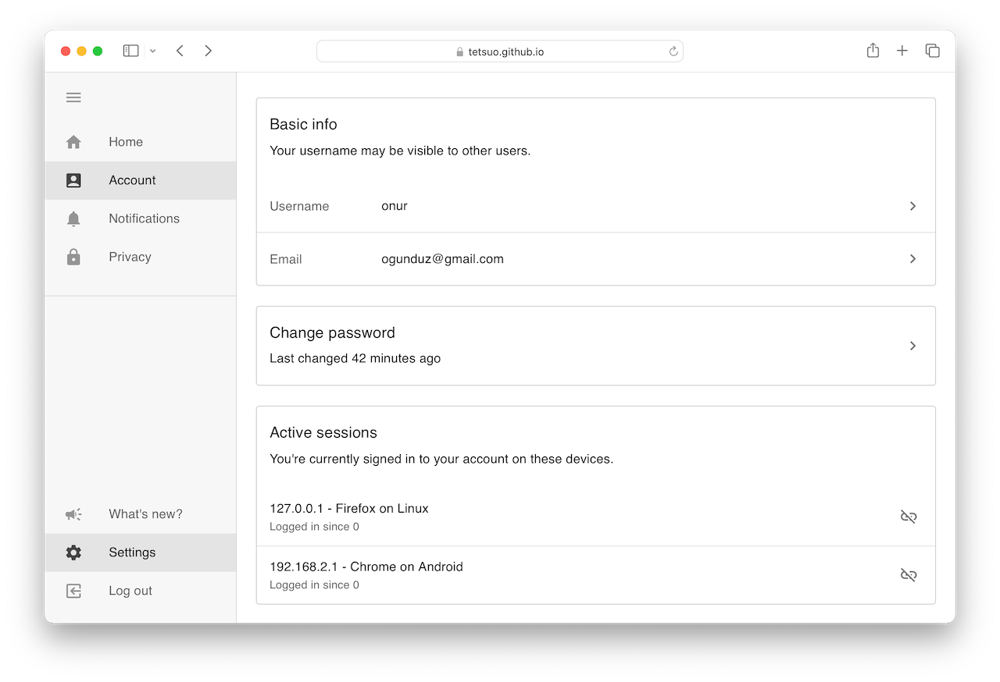

# dashboard

An experimental dashboard UI built with [restache](https://github.com/tetsuo/restache).



## Features

- No JSX (well, almost)
- Material UI for components
- Minimal router using history module
- Per-page data loading using React hooks
- Extremely lightweight setup, you only need Go!
- Cool design

## Tech stack

- React
- Restache
- Material UI
- date-fns
- history
- ESBuild
- ESM.sh
- Go

## Getting started

```
go mod tidy
go run . -dev -serve
```

Then navigate to `localhost:7070`.

Type `go run . -h` for other options.
